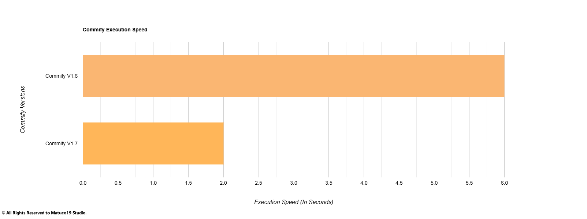

# 💫 Commify Milestones

Here only the main milestones of some versions will be mentioned, from the latest to the oldest version `(dates in MM/DD/YYYY order)`.

## V1.9 07/01/2025

### 🛠️ Refactor

In version 1.9, Commify underwent a significant refactor to improve code quality and maintainability. This included restructuring the codebase, optimizing imports, and enhancing the overall architecture.

---

### ♊ Gemini Provider

The Gemini provider was added in version 1.9, allowing users to utilize Gemini's capabilities within Commify. This provider is designed to be user-friendly and efficient, making it easier for developers to integrate Gemini into their workflows.

### 🧪 Improve Execution Time

In version 1.9, the execution time of Commify was improved by optimizing the code and reducing unnecessary delays and optmizing the codebase. This enhancement ensures that users can run Commify more efficiently, leading to faster results and a smoother experience.

### 🔐 Added Basic Security Methods

In version 1.9, the api-key management system has improved to support basic security methods.

---

## V1.7 02/04/2025

### 💨 Speed Up

Commify execution became faster from version 1.7 due to optimizations in module imports.

---

### 📄 Documentation

Commify documentation has become more detailed and easier to understand.

---

## V1.6 02/03/2025

### 🧠 Groq Provider

In version 1.6 the Groq provider was added to be an affordable and good quality provider.

---

### 🔑 Introduced Apikey Manager

APIkey management arguments were created for the `Openai` and `Groq` providers, so that it is not necessary to type the apikey every time you use Commify.

---

## V1.5 12/19/2024

### 🐞 Debug Mode

For development purposes, the `--debug` argument was created, it has the purpose of activating Commify's debug mode when run, it is not recommended for the end user.

---

## V1.4 12/12/2024

### 📢 Update Checker

Added a Commify update checker to prevent security vulnerabilities.

---

## V1.3 12/11/2024

### ♾️ Multiples Providers

The Commify V1.3 version was a game changer for later versions, as the possibility of using a provider in addition to Ollama, G4F, was added. This feature helped to add more providers today.

---

## V1.2 12/06/2024

### 🔓 open to Open-Source

Version 1.2 of Commify was the first open source release of the repository.
